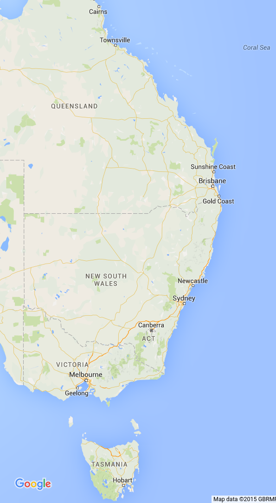

# Overview

Demonstrate two Elasticsearch Geolocation features:

1. Sorting by Distance
2. Geo Distance Filter

Use Docker plus a few commands from a terminal.

OS Ubuntu 14.04 plus Elasticsearch v2.0.0

# Setup

Clone the code repository and cd into it:

- `git clone https://github.com/rudijs/elasticsearch-geolocation-demo.git`
- `cd elasticsearch-geolocation-demo`

Start an Elasticsearch Docker container.

This command will download the official Elasticsearch v2 image from hub.docker.com and start a container instance:

- `sudo docker run -d --name elasticsearch -v "$PWD/esdata":/usr/share/elasticsearch/data -p 9200:9200 elasticsearch:2.0.0 -Des.network.bind_host=0.0.0.0`

Let's install the *elasticsearch-head* plugin so we'll have a web admin tool to see our data:

- `sudo docker exec -it elasticsearch /usr/share/elasticsearch/bin/plugin install mobz/elasticsearch-head`

Open a browser tab at [http://localhost:9200/_plugin/head/](http://localhost:9200/_plugin/head/)

# Create

**Create a new Elasticsearch index**

- `curl -XPUT http://localhost:9200/geo`

<!-- curl -XDELETE http://localhost:9200/geo -->

**Create a mapping on the new index for our data**

- `curl -XPUT localhost:9200/geo/_mapping/place --data-binary @mapping_place.json`

<!-- curl -XDELETE localhost:9200/geo/_mapping/place -->

## Geo Location Data

For this demostration we'll be using the East Coast of Australia from Cairns to Hobart.

**Add some 'places' to our index**

- `curl -XPOST http://localhost:9200/geo/place/  --data-binary @place_brisbane.json`
- `curl -XPOST http://localhost:9200/geo/place/  --data-binary @place_sydney.json`
- `curl -XPOST http://localhost:9200/geo/place/  --data-binary @place_melbourne.json`

# Search

Search all data (no sorting or filters):

- `curl -s -XGET http://localhost:9200/geo/place/_search`
- **Results**: Brisbane, Sydney, Melbourne

<!--
curl -s -XGET http://localhost:9200/geo/place/_search | jq '.hits.hits[]._source.place'
curl -s -XGET http://localhost:9200/geo/place/_search?q=melbourne | jq '.hits.hits[]._source.place'
-->

Search and sort by distance:

- `curl -s -XPOST http://localhost:9200/geo/place/_search --data-binary @query_distance_from_cairns.json`
- **Results**: Brisbane, Sydney, Melbourne

<!--
- `curl -s -XPOST http://localhost:9200/geo/place/_search --data-binary @query_distance_from_cairns.json | jq '.hits.hits[]._source.place'`
-->

- `curl -s -XPOST http://localhost:9200/geo/place/_search --data-binary @query_distance_from_hobart.json`
- **Results**: Melbourne, Sydney, Brisbane

<!--
curl -s -XPOST http://localhost:9200/geo/place/_search --data-binary @query_distance_from_hobart.json | jq '.hits.hits[]._source.place'
-->

- `curl -s -XPOST http://localhost:9200/geo/place/_search --data-binary @query_distance_from_canberra.json`
- **Results**: Sydney, Melbourne, Brisbane

<!--
curl -s -XPOST http://localhost:9200/geo/place/_search --data-binary @query_distance_from_canberra.json | jq '.hits.hits[]._source.place'
-->

Search, sort and filter by distance:

- `curl -s -XPOST http://localhost:9200/geo/place/_search --data-binary @query_distance_from_hobart_filter_1500km.json`
- **Results**: Melbourne, Sydney

<!--
curl -s -XPOST http://localhost:9200/geo/place/_search --data-binary @query_distance_from_hobart_filter_1500km.json | jq '.hits.hits[]._source.place`
-->

<!--
Cairns, Queensland, Australia
-16.917506, 145.760665

Hobart, Tasmania, Australia
-42.881856, 147.323999

Canberra, Australian Capital Territory, Australia
-35.282152, 149.125223
-->
